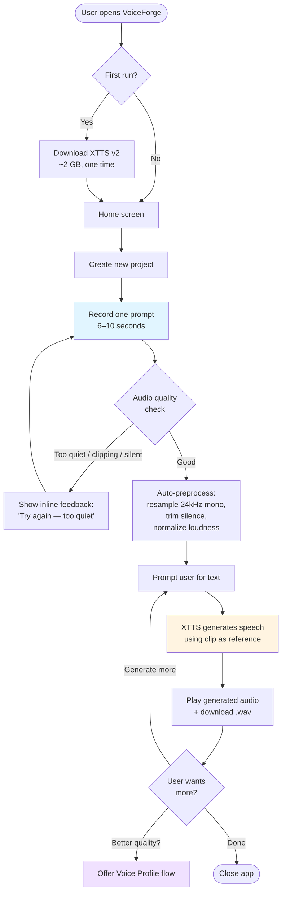
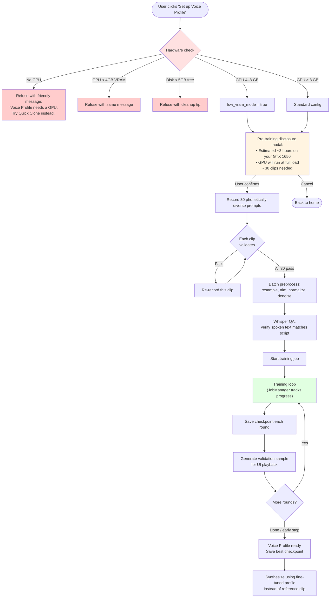
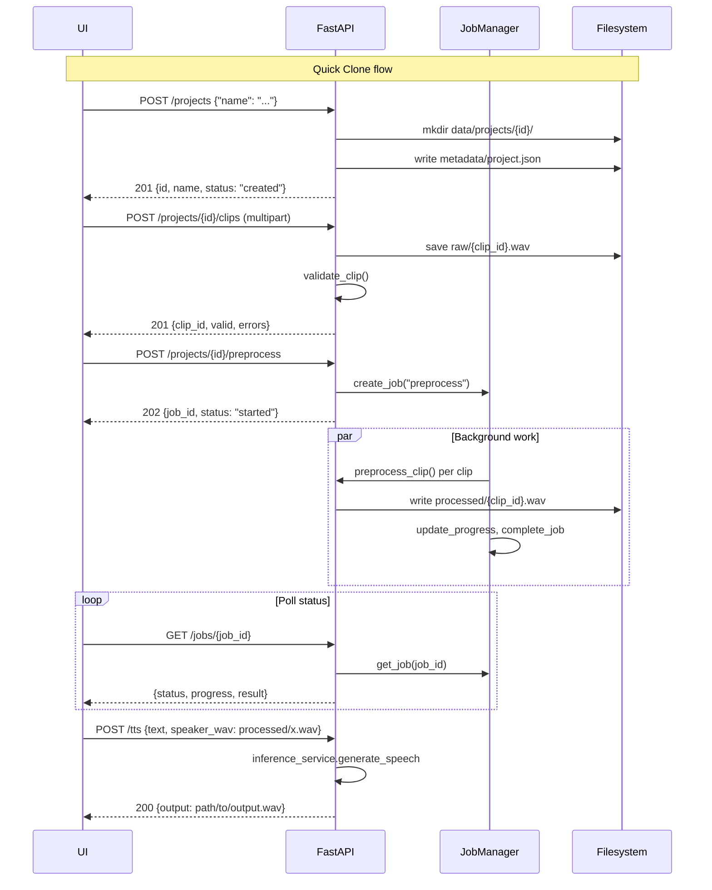

# VoiceForge

> Local-first desktop app for AI voice cloning. Record yourself, type text, hear it in your voice. No cloud, no subscription, no data leaves your machine.

Built around **XTTS v2** for speech synthesis, **FastAPI** for the backend, **Gradio** for the MVP UI, and packaged as a **Tauri** desktop app for the final shipping product.

---

## What it does

VoiceForge gives you two ways to clone a voice, balancing speed against quality:

| Path | Time to first audio | Hardware needed | Quality |
|------|---------------------|-----------------|---------|
| **Quick Clone** (default) | ~30 seconds | Any CPU | Good |
| **Voice Profile** (advanced) | 2–6 hours | GPU with ≥4 GB VRAM | Best |

Most users only need Quick Clone. Voice Profile is for power users who want studio-grade results.

---

## Architecture at a glance

```mermaid
graph TB
    subgraph "Tauri Desktop App"
        UI["Frontend UI<br/>(Gradio MVP → React/Svelte)"]
    end

    subgraph "Sidecar (Python)"
        API["FastAPI Server<br/>127.0.0.1:random_port"]

        subgraph "Routers"
            R1[/projects/]
            R2[/jobs/]
            R3[/tts /system /health]
        end

        subgraph "Services"
            PS[project_service]
            IS[inference_service]
        end

        subgraph "Audio Pipeline"
            REC[recorder.py]
            VAL[validator.py]
            PRE[preprocessor.py]
            TRA[transcriber.py]
        end

        subgraph "Engines"
            XTTS["XTTS v2<br/>(Coqui TTS)"]
            WHIS["faster-whisper<br/>(Whisper base)"]
        end

        JM[JobManager]
        HW[hardware.py]
    end

    subgraph "User Data Dir"
        FS["%APPDATA%/VoiceForge/<br/>├─ projects/{id}/<br/>│  ├─ raw/<br/>│  ├─ processed/<br/>│  ├─ checkpoints/<br/>│  └─ metadata/<br/>├─ models/<br/>└─ logs/"]
    end

    UI -->|HTTP| API
    API --> R1 & R2 & R3
    R1 --> PS
    R3 --> IS
    R1 --> REC & VAL & PRE
    R1 --> JM
    IS --> XTTS
    TRA --> WHIS
    PS --> FS
    REC --> FS
    PRE --> FS
    XTTS -->|voice cloning| FS
```

The Tauri shell spawns a Python sidecar that listens on localhost only. The frontend talks to the sidecar over HTTP. All user data — recordings, models, checkpoints — lives in the OS-standard user data directory, never next to the executable.

---

## Quick Clone — the primary user flow

This is what 90% of users will use. One recording, instant results.



**Key properties:**
- Works on any CPU — no GPU required
- Generation takes a few seconds per sentence on a modern CPU
- No training, no waiting around
- Reference clip is reused across sessions until the user replaces it

---

## Voice Profile — the advanced flow

Strictly opt-in, hardware-gated, with explicit time and resource warnings before kickoff.



**Key properties:**
- Refuses CPU-only training (24+ hours is not a shippable UX)
- Always discloses time and resource cost before kicking off
- Training is cancellable mid-run
- Background-safe: closing the window doesn't kill the job (post-M2)
- Generates a validation sample after each round so user can hear progress

---

## Audio pipeline (under the hood)

Every recorded clip goes through this pipeline before it can be used.

```mermaid
flowchart LR
    Upload[/Multipart upload<br/>POST /clips/]
    Upload --> Save["recorder.save_clip()<br/>writes raw/{uuid}.wav"]
    Save --> Validate["validator.validate_clip()"]

    subgraph "Validation checks"
        V1[Duration 3–15s]
        V2[Sample rate ≥ 24 kHz]
        V3[Peak < -1 dBFS<br/>no clipping]
        V4[SNR ≥ 20 dB<br/>not too noisy]
        V5[Silence ratio < 70%]
    end

    Validate --> V1 & V2 & V3 & V4 & V5
    V1 & V2 & V3 & V4 & V5 --> Result{All pass?}
    Result -->|No| FriendlyErr["Friendly error to UI:<br/>'Move closer to mic'"]
    Result -->|Yes| Pre["preprocessor.preprocess_clip()"]

    subgraph "Preprocess pipeline"
        P1[Load + mono]
        P2[Resample to 24 kHz]
        P3[Trim silence librosa]
        P4[Optional spectral denoise]
        P5[Peak normalize -3 dBFS]
        P6[Save processed/{uuid}.wav]
    end

    Pre --> P1 --> P2 --> P3 --> P4 --> P5 --> P6
    P6 --> Ready[Clip ready for use]

    style FriendlyErr fill:#ffcccc
    style Ready fill:#ccffcc
```

**Why each step matters:**
- **Mono first** — cheaper to resample one channel
- **Resample before trim** — silence detection uses energy in the target rate
- **Trim before normalize** — don't normalize against silent edges
- **Normalize last** — final loudness on clean audio
- **Optional denoise** — only useful for steady-state noise like fan hum

---

## API surface (current state)



### Endpoints

| Method | Path | Purpose | Status |
|--------|------|---------|--------|
| `GET`  | `/health` | Liveness check | ✅ |
| `GET`  | `/system` | Hardware profile (GPU, RAM, disk, OS) | ✅ |
| `POST` | `/tts` | Synthesize speech (with optional reference clip) | ✅ |
| `POST` | `/projects` | Create a new voice project | ✅ |
| `GET`  | `/projects/{id}` | Get project state, clip count, validation status | ✅ |
| `POST` | `/projects/{id}/clips` | Upload a clip (multipart) | ✅ |
| `GET`  | `/projects/{id}/clips` | List all clips for a project | ✅ |
| `DELETE` | `/projects/{id}/clips/{clip_id}` | Delete a clip (re-record support) | ✅ |
| `POST` | `/projects/{id}/preprocess` | Start async preprocess job | ✅ |
| `GET`  | `/jobs/{job_id}` | Poll job status / progress / result | ✅ |
| `POST` | `/projects/{id}/synthesize` | Generate speech using project's reference/profile | 🔜 M1 |
| `POST` | `/projects/{id}/train` | Start fine-tuning job | 🔜 M2 |
| `POST` | `/jobs/{id}/cancel` | Cooperative job cancellation | 🔜 M2 |
| `POST` | `/projects/{id}/export` | Export profile as `.zip` | 🔜 M3 |

---

## Project structure

```
voiceforge/
├── backend/
│   ├── main.py                  # FastAPI app entry point
│   ├── api/                     # HTTP routers
│   │   ├── inference.py         # POST /tts
│   │   ├── projects.py          # /projects/* endpoints
│   │   └── jobs.py              # GET /jobs/{id}
│   ├── audio/                   # Audio pipeline (pure Python, no FFmpeg)
│   │   ├── recorder.py          # Save uploaded clips
│   │   ├── validator.py         # Quality checks
│   │   ├── preprocessor.py      # Resample, trim, normalize
│   │   └── transcriber.py       # Whisper QA + prompt loader
│   ├── services/                # Business logic
│   │   ├── inference_service.py # XTTS singleton + synth
│   │   └── project_service.py   # Project lifecycle on disk
│   ├── jobs/                    # Background task framework
│   │   ├── job.py               # Job dataclass
│   │   ├── job_status.py        # PENDING / RUNNING / COMPLETED / FAILED
│   │   ├── job_manager.py       # In-memory job tracker
│   │   └── instance.py          # Singleton
│   ├── system/
│   │   └── hardware.py          # GPU/RAM/disk detection
│   ├── core/
│   │   ├── settings.py          # Paths, runtime config, low_vram_mode
│   │   └── logger.py            # Structured logging
│   └── pipelines/               # (planned)
│       └── training.py          # XTTS fine-tuning loop (M2)
├── data/
│   ├── projects/{id}/
│   │   ├── raw/                 # Uploaded clips
│   │   ├── processed/           # Resampled, normalized
│   │   ├── checkpoints/         # Training output (M2)
│   │   ├── exports/             # Generated audio
│   │   └── metadata/
│   ├── scripts/
│   │   └── default_prompts.json # 30 EN + 30 HI prompts
│   ├── logs/
│   ├── cache/
│   └── temp/
├── frontend/                    # (planned) Gradio MVP, then Tauri
├── models/                      # XTTS + Whisper weights (downloaded at runtime)
├── requirements.txt
└── TASKS.md                     # Living roadmap
```

---

## Tech stack

**Audio + ML:**
- [Coqui TTS](https://github.com/coqui-ai/TTS) — XTTS v2 model (multilingual, voice-cloning capable)
- [faster-whisper](https://github.com/SYSTRAN/faster-whisper) — Whisper transcription, 4× faster than reference
- [librosa](https://librosa.org/) — audio loading, resampling, silence trimming, STFT
- [soundfile](https://python-soundfile.readthedocs.io/) — WAV I/O
- [PyTorch](https://pytorch.org/) — model runtime (CPU build by default; CUDA optional)

**Backend:**
- [FastAPI](https://fastapi.tiangolo.com/) — HTTP API + automatic OpenAPI docs
- [Pydantic](https://docs.pydantic.dev/) — request/response validation
- [SQLAlchemy](https://www.sqlalchemy.org/) — persistence (planned, M1)

**Packaging (planned):**
- [Tauri](https://tauri.app/) — desktop shell with web frontend, sidecar Python backend
- [PyInstaller](https://pyinstaller.org/) or [shiv](https://github.com/linkedin/shiv) — Python sidecar bundling

---

## Running locally (development)

```bash
# Clone
git clone https://github.com/hk2166/Modulizer.git voiceforge
cd voiceforge

# Set up a virtualenv
python3.11 -m venv venv
source venv/bin/activate

# Install deps (CPU build of torch)
pip install -r backend/requirements.txt
pip install torch==2.5.1+cpu torchaudio==2.5.1+cpu --index-url https://download.pytorch.org/whl/cpu

# Run the backend
uvicorn backend.main:app --reload
```

The API will be live at `http://localhost:8000`. OpenAPI docs at `http://localhost:8000/docs`.

### Quick smoke test

```bash
# Create a project
curl -X POST http://localhost:8000/projects \
  -H "Content-Type: application/json" \
  -d '{"name": "Test Voice"}'

# Upload a clip
curl -X POST http://localhost:8000/projects/{id}/clips \
  -F "file=@data/output.wav"

# Generate speech using the clip as reference
curl -X POST http://localhost:8000/tts \
  -H "Content-Type: application/json" \
  -d '{"text": "Hello world", "speaker_wav": "/path/to/processed/clip.wav"}'
```

---

## Hardware compatibility

| Hardware | Quick Clone | Voice Profile (training) |
|----------|-------------|--------------------------|
| **CPU only** (any modern x86/ARM) | ✅ Works, ~5s per sentence | ❌ Refused — 24+ hours, not shippable |
| **GTX 1650 4 GB** (low-VRAM) | ✅ Faster generation | ⚠️ Works in low-VRAM mode, ~3–6 hours |
| **RTX 3060 8 GB+** | ✅ Near-realtime | ✅ Standard config, ~1–2 hours |
| **Apple M-series** | ✅ Via CPU build | 🔜 MPS backend support TBD |

The app detects hardware on first run and gates Voice Profile accordingly.

---

## Roadmap

See [TASKS.md](./TASKS.md) for the full task breakdown across milestones.

- **M0 — Foundation** — backend skeleton, XTTS works end-to-end ✅ (mostly done)
- **M1 — Quick Voice Clone** — record 1 clip, generate, playback (current focus)
- **M2 — Voice Profile (advanced)** — opt-in fine-tuning with hardware gating
- **M3 — Polish, multilingual, export** — language picker, profile export/import
- **M4 — Tauri packaging** — ship as a Windows .exe / macOS .dmg / Linux AppImage

---

## Design principles

1. **UX is the product.** No ML jargon ever leaks to the user. "Set up your voice profile" — not "train a model." "Saved progress" — not "checkpoint."
2. **Local-first, always.** No cloud fallback, no telemetry by default. Your voice never leaves your machine.
3. **Default to the path that works for everyone.** Quick Clone on CPU is the default flow. Fine-tuning is opt-in with up-front cost disclosure.
4. **Refuse rather than ship a broken UX.** No CPU training option — telling someone "wait 24 hours" is worse than refusing.
5. **Friendly errors, action-oriented.** "Move closer to the microphone" — not "SNR below threshold."

---

## License

TBD — likely MIT for the application code, with separate notes about the [Coqui XTTS license](https://coqui.ai/cpml) which applies to generated audio and exported voice profiles.
